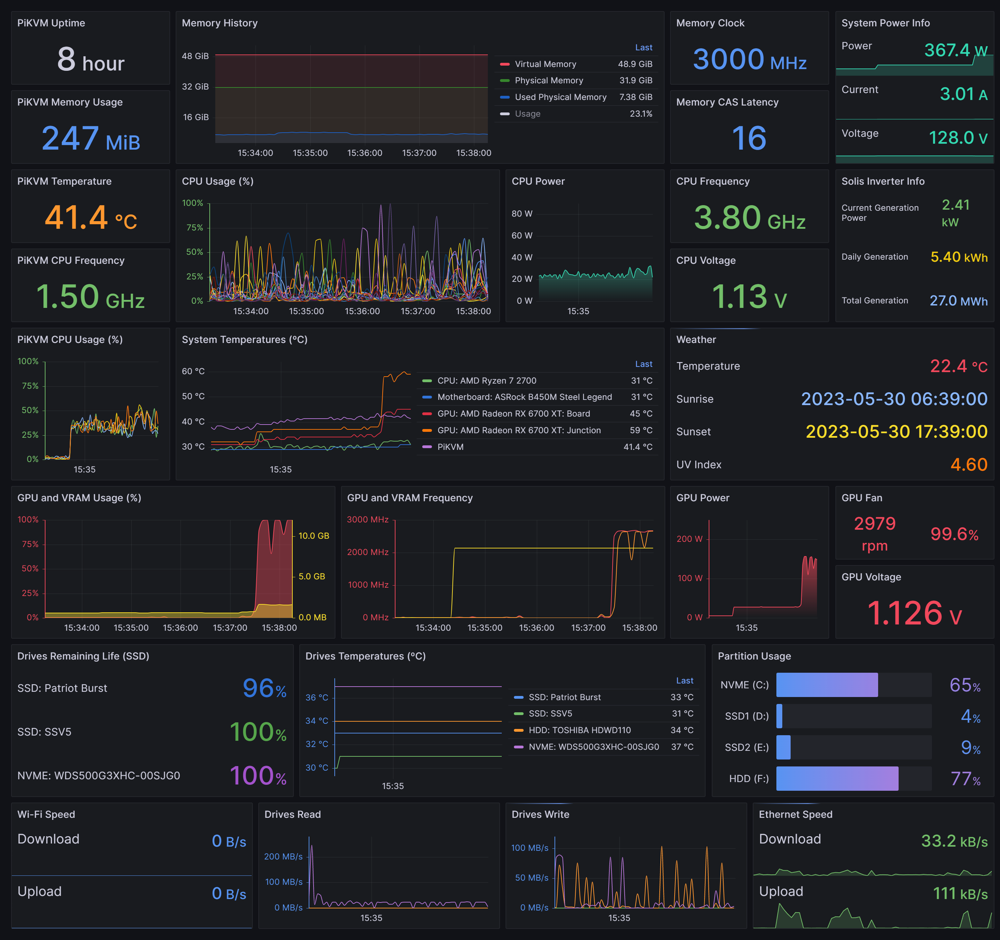

# Grafana for All
Grafana Dashboard using metrics from Prometheus, Infinity, Tuya Exporter, Promdapter, Windows Exporter, Solis Inverter Exporter, Node Exporter, Open Meteo API

## Dashboard

## Docs
You can find useful information about several components and answers to frequently asked questions in each repository. If you think that there is something missing, you are invited to submit a pull request to the grafana-for-all repository.

## Repositories

* Prometheus:
https://github.com/prometheus/prometheus

* Inifinity:
https://github.com/yesoreyeram/grafana-infinity-datasource

* Tuya Exporter: (Smart Plug)
https://github.com/rkosegi/tuya-smartplug-exporter
  
* PromDapter: (HWiNFO)
https://github.com/kallex/PromDapter
  
* Windows Exporter: (Windows Info)
https://github.com/prometheus-community/windows_exporter
  
* Solis Inverter JSON API: (Photovoltaic system with Solis inverter)
https://github.com/fss/solis-inverter
  
* Node Exporter: (Used on PiKVM - IP-KVM on Raspberry Pi)
https://github.com/prometheus/node_exporter
  
* Open Meteo JSON API: (Weather)
https://github.com/open-meteo/open-meteo
